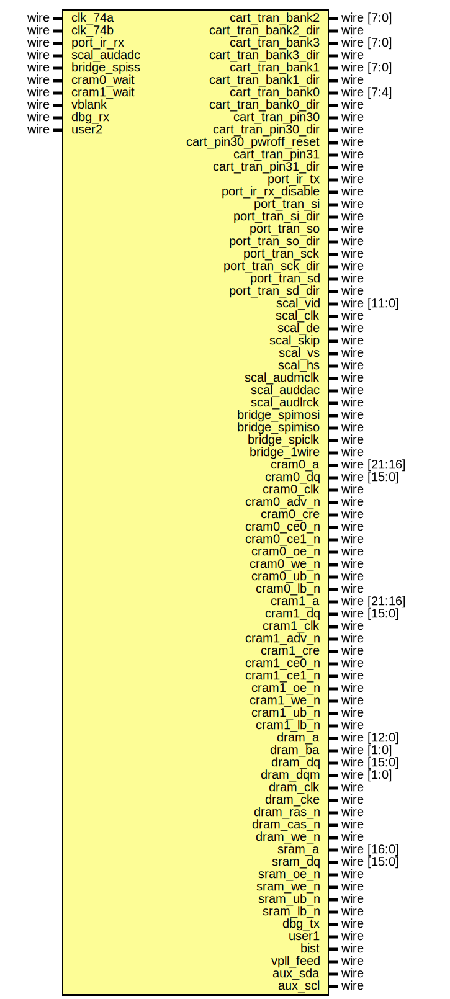

# Entity: apf_top 

- **File**: apf_top.v
## Diagram

## Ports

| Port name               | Direction | Type            | Description |
| ----------------------- | --------- | --------------- | ----------- |
| clk_74a                 | input     | wire            |             |
| clk_74b                 | input     | wire            |             |
| cart_tran_bank2         | inout     | wire    [7:0]   |             |
| cart_tran_bank2_dir     | output    | wire            |             |
| cart_tran_bank3         | inout     | wire    [7:0]   |             |
| cart_tran_bank3_dir     | output    | wire            |             |
| cart_tran_bank1         | inout     | wire    [7:0]   |             |
| cart_tran_bank1_dir     | output    | wire            |             |
| cart_tran_bank0         | inout     | wire    [7:4]   |             |
| cart_tran_bank0_dir     | output    | wire            |             |
| cart_tran_pin30         | inout     | wire            |             |
| cart_tran_pin30_dir     | output    | wire            |             |
| cart_pin30_pwroff_reset | output    | wire            |             |
| cart_tran_pin31         | inout     | wire            |             |
| cart_tran_pin31_dir     | output    | wire            |             |
| port_ir_rx              | input     | wire            |             |
| port_ir_tx              | output    | wire            |             |
| port_ir_rx_disable      | output    | wire            |             |
| port_tran_si            | inout     | wire            |             |
| port_tran_si_dir        | output    | wire            |             |
| port_tran_so            | inout     | wire            |             |
| port_tran_so_dir        | output    | wire            |             |
| port_tran_sck           | inout     | wire            |             |
| port_tran_sck_dir       | output    | wire            |             |
| port_tran_sd            | inout     | wire            |             |
| port_tran_sd_dir        | output    | wire            |             |
| scal_vid                | inout     | wire    [11:0]  |             |
| scal_clk                | inout     | wire            |             |
| scal_de                 | inout     | wire            |             |
| scal_skip               | inout     | wire            |             |
| scal_vs                 | inout     | wire            |             |
| scal_hs                 | inout     | wire            |             |
| scal_audmclk            | output    | wire            |             |
| scal_audadc             | input     | wire            |             |
| scal_auddac             | output    | wire            |             |
| scal_audlrck            | output    | wire            |             |
| bridge_spimosi          | inout     | wire            |             |
| bridge_spimiso          | inout     | wire            |             |
| bridge_spiclk           | inout     | wire            |             |
| bridge_spiss            | input     | wire            |             |
| bridge_1wire            | inout     | wire            |             |
| cram0_a                 | output    | wire    [21:16] |             |
| cram0_dq                | inout     | wire    [15:0]  |             |
| cram0_wait              | input     | wire            |             |
| cram0_clk               | output    | wire            |             |
| cram0_adv_n             | output    | wire            |             |
| cram0_cre               | output    | wire            |             |
| cram0_ce0_n             | output    | wire            |             |
| cram0_ce1_n             | output    | wire            |             |
| cram0_oe_n              | output    | wire            |             |
| cram0_we_n              | output    | wire            |             |
| cram0_ub_n              | output    | wire            |             |
| cram0_lb_n              | output    | wire            |             |
| cram1_a                 | output    | wire    [21:16] |             |
| cram1_dq                | inout     | wire    [15:0]  |             |
| cram1_wait              | input     | wire            |             |
| cram1_clk               | output    | wire            |             |
| cram1_adv_n             | output    | wire            |             |
| cram1_cre               | output    | wire            |             |
| cram1_ce0_n             | output    | wire            |             |
| cram1_ce1_n             | output    | wire            |             |
| cram1_oe_n              | output    | wire            |             |
| cram1_we_n              | output    | wire            |             |
| cram1_ub_n              | output    | wire            |             |
| cram1_lb_n              | output    | wire            |             |
| dram_a                  | output    | wire    [12:0]  |             |
| dram_ba                 | output    | wire    [1:0]   |             |
| dram_dq                 | inout     | wire    [15:0]  |             |
| dram_dqm                | output    | wire    [1:0]   |             |
| dram_clk                | output    | wire            |             |
| dram_cke                | output    | wire            |             |
| dram_ras_n              | output    | wire            |             |
| dram_cas_n              | output    | wire            |             |
| dram_we_n               | output    | wire            |             |
| sram_a                  | output    | wire    [16:0]  |             |
| sram_dq                 | inout     | wire    [15:0]  |             |
| sram_oe_n               | output    | wire            |             |
| sram_we_n               | output    | wire            |             |
| sram_ub_n               | output    | wire            |             |
| sram_lb_n               | output    | wire            |             |
| vblank                  | input     | wire            |             |
| dbg_tx                  | output    | wire            |             |
| dbg_rx                  | input     | wire            |             |
| user1                   | output    | wire            |             |
| user2                   | input     | wire            |             |
| bist                    | inout     | wire            |             |
| vpll_feed               | output    | wire            |             |
| aux_sda                 | inout     | wire            |             |
| aux_scl                 | output    | wire            |             |
## Signals

| Name                 | Type        | Description |
| -------------------- | ----------- | ----------- |
| count                | reg [24:0]  |             |
| reset_n              | reg         |             |
| video_rgb            | wire [23:0] |             |
| video_rgb_clock      | wire        |             |
| video_rgb_clock_90   | wire        |             |
| video_de             | wire        |             |
| video_skip           | wire        |             |
| video_vs             | wire        |             |
| video_hs             | wire        |             |
| scal_ddio_12         | wire [11:0] |             |
| scal_ddio_ctrl       | wire [3:0]  |             |
| cont1_key            | wire [15:0] |             |
| cont2_key            | wire [15:0] |             |
| cont3_key            | wire [15:0] |             |
| cont4_key            | wire [15:0] |             |
| cont1_joy            | wire [31:0] |             |
| cont2_joy            | wire [31:0] |             |
| cont3_joy            | wire [31:0] |             |
| cont4_joy            | wire [31:0] |             |
| cont1_trig           | wire [15:0] |             |
| cont2_trig           | wire [15:0] |             |
| cont3_trig           | wire [15:0] |             |
| cont4_trig           | wire [15:0] |             |
| bridge_endian_little | wire        |             |
| bridge_addr          | wire [31:0] |             |
| bridge_rd            | wire        |             |
| bridge_rd_data       | wire [31:0] |             |
| bridge_wr            | wire        |             |
| bridge_wr_data       | wire [31:0] |             |
## Processes
- unnamed: ( @(posedge clk_74a) )
  - **Type:** always
## Instantiations

- isco: mf_ddio_bidir_12
- iscc: mf_ddio_bidir_12
- isclk: mf_ddio_bidir_12
- ipm: io_pad_controller
- ibs: io_bridge_peripheral
- ic: core_top
