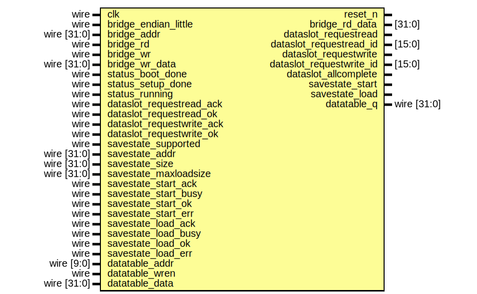
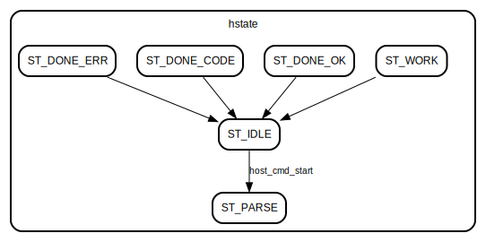
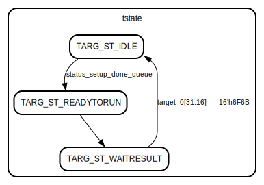

# Entity: core_bridge_cmd 

- **File**: core_bridge_cmd.v
## Diagram

## Ports

| Port name                 | Direction | Type           | Description |
| ------------------------- | --------- | -------------- | ----------- |
| clk                       | input     | wire           |             |
| reset_n                   | output    |                |             |
| bridge_endian_little      | input     | wire           |             |
| bridge_addr               | input     | wire    [31:0] |             |
| bridge_rd                 | input     | wire           |             |
| bridge_rd_data            | output    | [31:0]         |             |
| bridge_wr                 | input     | wire           |             |
| bridge_wr_data            | input     | wire    [31:0] |             |
| status_boot_done          | input     | wire           |             |
| status_setup_done         | input     | wire           |             |
| status_running            | input     | wire           |             |
| dataslot_requestread      | output    |                |             |
| dataslot_requestread_id   | output    | [15:0]         |             |
| dataslot_requestread_ack  | input     | wire           |             |
| dataslot_requestread_ok   | input     | wire           |             |
| dataslot_requestwrite     | output    |                |             |
| dataslot_requestwrite_id  | output    | [15:0]         |             |
| dataslot_requestwrite_ack | input     | wire           |             |
| dataslot_requestwrite_ok  | input     | wire           |             |
| dataslot_allcomplete      | output    |                |             |
| savestate_supported       | input     | wire           |             |
| savestate_addr            | input     | wire    [31:0] |             |
| savestate_size            | input     | wire    [31:0] |             |
| savestate_maxloadsize     | input     | wire    [31:0] |             |
| savestate_start           | output    |                |             |
| savestate_start_ack       | input     | wire           |             |
| savestate_start_busy      | input     | wire           |             |
| savestate_start_ok        | input     | wire           |             |
| savestate_start_err       | input     | wire           |             |
| savestate_load            | output    |                |             |
| savestate_load_ack        | input     | wire           |             |
| savestate_load_busy       | input     | wire           |             |
| savestate_load_ok         | input     | wire           |             |
| savestate_load_err        | input     | wire           |             |
| datatable_addr            | input     | wire    [9:0]  |             |
| datatable_wren            | input     | wire           |             |
| datatable_data            | input     | wire    [31:0] |             |
| datatable_q               | output    | wire    [31:0] |             |
## Signals

| Name                    | Type           | Description |
| ----------------------- | -------------- | ----------- |
| bridge_wr_data_in       | reg     [31:0] |             |
| bridge_rd_data_out      | reg     [31:0] |             |
| endian_little_s         | wire           |             |
| host_0                  | reg     [31:0] |             |
| host_4                  | reg     [31:0] |             |
| host_8                  | reg     [31:0] |             |
| host_20                 | reg     [31:0] |             |
| host_24                 | reg     [31:0] |             |
| host_28                 | reg     [31:0] |             |
| host_2C                 | reg     [31:0] |             |
| host_40                 | reg     [31:0] |             |
| host_44                 | reg     [31:0] |             |
| host_48                 | reg     [31:0] |             |
| host_4C                 | reg     [31:0] |             |
| host_cmd_start          | reg            |             |
| host_cmd_startval       | reg     [15:0] |             |
| host_cmd                | reg     [15:0] |             |
| host_resultcode         | reg     [15:0] |             |
| hstate                  | reg     [3:0]  |             |
| target_0                | reg     [31:0] |             |
| target_4                | reg     [31:0] |             |
| target_8                | reg     [31:0] |             |
| target_20               | reg     [31:0] |             |
| target_24               | reg     [31:0] |             |
| target_28               | reg     [31:0] |             |
| target_2C               | reg     [31:0] |             |
| target_40               | reg     [31:0] |             |
| target_44               | reg     [31:0] |             |
| target_48               | reg     [31:0] |             |
| target_4C               | reg     [31:0] |             |
| tstate                  | reg     [3:0]  |             |
| status_setup_done_1     | reg            |             |
| status_setup_done_queue | reg            |             |
| b_datatable_q           | wire [31:0]    |             |
| b_datatable_addr        | reg     [9:0]  |             |
| b_datatable_wren        | reg            |             |
## Constants

| Name               | Type  | Value | Description |
| ------------------ | ----- | ----- | ----------- |
| ST_IDLE            | [3:0] | 'd0   |             |
| ST_PARSE           | [3:0] | 'd1   |             |
| ST_WORK            | [3:0] | 'd2   |             |
| ST_DONE_OK         | [3:0] | 'd13  |             |
| ST_DONE_CODE       | [3:0] | 'd14  |             |
| ST_DONE_ERR        | [3:0] | 'd15  |             |
| TARG_ST_IDLE       | [3:0] | 'd0   |             |
| TARG_ST_READYTORUN | [3:0] | 'd1   |             |
| TARG_ST_DISPMSG    | [3:0] | 'd2   |             |
| TARG_ST_SLOTREAD   | [3:0] | 'd3   |             |
| TARG_ST_SLOTRELOAD | [3:0] | 'd4   |             |
| TARG_ST_SLOTWRITE  | [3:0] | 'd5   |             |
| TARG_ST_SLOTFLUSH  | [3:0] | 'd6   |             |
| TARG_ST_WAITRESULT | [3:0] | 'd15  |             |
## Processes
- unnamed: ( @(*) )
  - **Type:** always
- unnamed: ( @(posedge clk) )
  - **Type:** always
## Instantiations

- s01: synch_3
- idt: mf_datatable
## State machines

