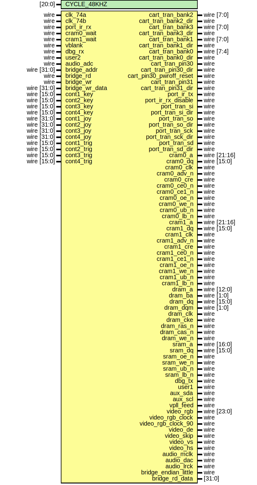

# Entity: core_top 

- **File**: core_top.v
## Diagram

## Generics

| Generic name | Type   | Value          | Description |
| ------------ | ------ | -------------- | ----------- |
| CYCLE_48KHZ  | [20:0] | 21'd122880 * 2 |             |
## Ports

| Port name               | Direction | Type            | Description |
| ----------------------- | --------- | --------------- | ----------- |
| clk_74a                 | input     | wire            |             |
| clk_74b                 | input     | wire            |             |
| cart_tran_bank2         | inout     | wire    [7:0]   |             |
| cart_tran_bank2_dir     | output    | wire            |             |
| cart_tran_bank3         | inout     | wire    [7:0]   |             |
| cart_tran_bank3_dir     | output    | wire            |             |
| cart_tran_bank1         | inout     | wire    [7:0]   |             |
| cart_tran_bank1_dir     | output    | wire            |             |
| cart_tran_bank0         | inout     | wire    [7:4]   |             |
| cart_tran_bank0_dir     | output    | wire            |             |
| cart_tran_pin30         | inout     | wire            |             |
| cart_tran_pin30_dir     | output    | wire            |             |
| cart_pin30_pwroff_reset | output    | wire            |             |
| cart_tran_pin31         | inout     | wire            |             |
| cart_tran_pin31_dir     | output    | wire            |             |
| port_ir_rx              | input     | wire            |             |
| port_ir_tx              | output    | wire            |             |
| port_ir_rx_disable      | output    | wire            |             |
| port_tran_si            | inout     | wire            |             |
| port_tran_si_dir        | output    | wire            |             |
| port_tran_so            | inout     | wire            |             |
| port_tran_so_dir        | output    | wire            |             |
| port_tran_sck           | inout     | wire            |             |
| port_tran_sck_dir       | output    | wire            |             |
| port_tran_sd            | inout     | wire            |             |
| port_tran_sd_dir        | output    | wire            |             |
| cram0_a                 | output    | wire    [21:16] |             |
| cram0_dq                | inout     | wire    [15:0]  |             |
| cram0_wait              | input     | wire            |             |
| cram0_clk               | output    | wire            |             |
| cram0_adv_n             | output    | wire            |             |
| cram0_cre               | output    | wire            |             |
| cram0_ce0_n             | output    | wire            |             |
| cram0_ce1_n             | output    | wire            |             |
| cram0_oe_n              | output    | wire            |             |
| cram0_we_n              | output    | wire            |             |
| cram0_ub_n              | output    | wire            |             |
| cram0_lb_n              | output    | wire            |             |
| cram1_a                 | output    | wire    [21:16] |             |
| cram1_dq                | inout     | wire    [15:0]  |             |
| cram1_wait              | input     | wire            |             |
| cram1_clk               | output    | wire            |             |
| cram1_adv_n             | output    | wire            |             |
| cram1_cre               | output    | wire            |             |
| cram1_ce0_n             | output    | wire            |             |
| cram1_ce1_n             | output    | wire            |             |
| cram1_oe_n              | output    | wire            |             |
| cram1_we_n              | output    | wire            |             |
| cram1_ub_n              | output    | wire            |             |
| cram1_lb_n              | output    | wire            |             |
| dram_a                  | output    | wire    [12:0]  |             |
| dram_ba                 | output    | wire    [1:0]   |             |
| dram_dq                 | inout     | wire    [15:0]  |             |
| dram_dqm                | output    | wire    [1:0]   |             |
| dram_clk                | output    | wire            |             |
| dram_cke                | output    | wire            |             |
| dram_ras_n              | output    | wire            |             |
| dram_cas_n              | output    | wire            |             |
| dram_we_n               | output    | wire            |             |
| sram_a                  | output    | wire    [16:0]  |             |
| sram_dq                 | inout     | wire    [15:0]  |             |
| sram_oe_n               | output    | wire            |             |
| sram_we_n               | output    | wire            |             |
| sram_ub_n               | output    | wire            |             |
| sram_lb_n               | output    | wire            |             |
| vblank                  | input     | wire            |             |
| dbg_tx                  | output    | wire            |             |
| dbg_rx                  | input     | wire            |             |
| user1                   | output    | wire            |             |
| user2                   | input     | wire            |             |
| aux_sda                 | inout     | wire            |             |
| aux_scl                 | output    | wire            |             |
| vpll_feed               | output    | wire            |             |
| video_rgb               | output    | wire    [23:0]  |             |
| video_rgb_clock         | output    | wire            |             |
| video_rgb_clock_90      | output    | wire            |             |
| video_de                | output    | wire            |             |
| video_skip              | output    | wire            |             |
| video_vs                | output    | wire            |             |
| video_hs                | output    | wire            |             |
| audio_mclk              | output    | wire            |             |
| audio_adc               | input     | wire            |             |
| audio_dac               | output    | wire            |             |
| audio_lrck              | output    | wire            |             |
| bridge_endian_little    | output    | wire            |             |
| bridge_addr             | input     | wire    [31:0]  |             |
| bridge_rd               | input     | wire            |             |
| bridge_rd_data          | output    | [31:0]          |             |
| bridge_wr               | input     | wire            |             |
| bridge_wr_data          | input     | wire    [31:0]  |             |
| cont1_key               | input     | wire    [15:0]  |             |
| cont2_key               | input     | wire    [15:0]  |             |
| cont3_key               | input     | wire    [15:0]  |             |
| cont4_key               | input     | wire    [15:0]  |             |
| cont1_joy               | input     | wire    [31:0]  |             |
| cont2_joy               | input     | wire    [31:0]  |             |
| cont3_joy               | input     | wire    [31:0]  |             |
| cont4_joy               | input     | wire    [31:0]  |             |
| cont1_trig              | input     | wire    [15:0]  |             |
| cont2_trig              | input     | wire    [15:0]  |             |
| cont3_trig              | input     | wire    [15:0]  |             |
| cont4_trig              | input     | wire    [15:0]  |             |
## Signals

| Name                      | Type               | Description |
| ------------------------- | ------------------ | ----------- |
| reset_n                   | wire               |             |
| cmd_bridge_rd_data        | wire [31:0]        |             |
| status_boot_done          | wire               |             |
| status_setup_done         | wire               |             |
| status_running            | wire               |             |
| dataslot_requestread      | wire               |             |
| dataslot_requestread_id   | wire [15:0]        |             |
| dataslot_requestread_ack  | wire               |             |
| dataslot_requestread_ok   | wire               |             |
| dataslot_requestwrite     | wire               |             |
| dataslot_requestwrite_id  | wire [15:0]        |             |
| dataslot_requestwrite_ack | wire               |             |
| dataslot_requestwrite_ok  | wire               |             |
| dataslot_allcomplete      | wire               |             |
| savestate_supported       | wire               |             |
| savestate_addr            | wire [31:0]        |             |
| savestate_size            | wire [31:0]        |             |
| savestate_maxloadsize     | wire [31:0]        |             |
| savestate_start           | wire               |             |
| savestate_start_ack       | wire               |             |
| savestate_start_busy      | wire               |             |
| savestate_start_ok        | wire               |             |
| savestate_start_err       | wire               |             |
| savestate_load            | wire               |             |
| savestate_load_ack        | wire               |             |
| savestate_load_busy       | wire               |             |
| savestate_load_ok         | wire               |             |
| savestate_load_err        | wire               |             |
| datatable_addr            | wire [9:0]         |             |
| datatable_wren            | wire               |             |
| datatable_data            | wire [31:0]        |             |
| datatable_q               | wire [31:0]        |             |
| frame_count               | reg [15:0]         |             |
| x_count                   | reg [9:0]          |             |
| y_count                   | reg [9:0]          |             |
| visible_x                 | wire [9:0]         |             |
| visible_y                 | wire [9:0]         |             |
| vidout_rgb                | reg [23:0]         |             |
| vidout_de                 | reg                |             |
| vidout_de_1               | reg                |             |
| vidout_skip               | reg                |             |
| vidout_vs                 | reg                |             |
| vidout_hs                 | reg                |             |
| vidout_hs_1               | reg                |             |
| square_x                  | reg [9:0]          |             |
| square_y                  | reg [9:0]          |             |
| audgen_accum              | reg         [21:0] |             |
| audgen_mclk               | reg                |             |
| aud_mclk_divider          | reg [1:0]          |             |
| audgen_sclk               | wire               |             |
| audgen_lrck_1             | reg                |             |
| audgen_lrck_cnt           | reg     [4:0]      |             |
| audgen_lrck               | reg                |             |
| audgen_dac                | reg                |             |
| clk_core_12288            | wire               |             |
| clk_core_12288_90deg      | wire               |             |
| pll_core_locked           | wire               |             |
## Constants

| Name         | Type | Value | Description |
| ------------ | ---- | ----- | ----------- |
| VID_V_BPORCH |      | 'd10  |             |
| VID_V_ACTIVE |      | 'd240 |             |
| VID_V_TOTAL  |      | 'd512 |             |
| VID_H_BPORCH |      | 'd10  |             |
| VID_H_ACTIVE |      | 'd320 |             |
| VID_H_TOTAL  |      | 'd400 |             |
## Processes
- unnamed: ( @(*) )
  - **Type:** always
- unnamed: ( @(posedge clk_core_12288 or negedge reset_n) )
  - **Type:** always
- unnamed: ( @(posedge clk_74a) )
  - **Type:** always
- unnamed: ( @(posedge audgen_mclk) )
  - **Type:** always
- unnamed: ( @(negedge audgen_sclk) )
  - **Type:** always
## Instantiations

- mp1: mf_pllbase
