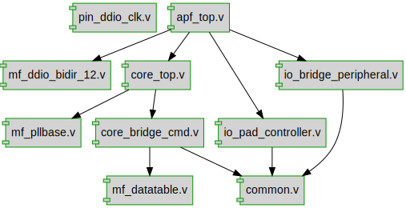

# Documentation for: gateman-pocket

Generated by **TerosHDL** © 2020-2021 License GPLv3 Carlos Alberto Ruiz Naranjo (carlosruiznaranjo@gmail.com) Ismael Perez Rojo (ismaelprojo@gmail.com)  Project revision 2022-08-27 20:09:32  

## Designs

- Module: [core_bridge_cmd](./doc_internal/core_bridge_cmd.md)
- Module: [core_top](./doc_internal/core_top.md)
- Module: [mf_pllbase](./doc_internal/mf_pllbase.md)
- Module: [pin_ddio_clk](./doc_internal/pin_ddio_clk.md)
- Module: [apf_top](./doc_internal/apf_top.md)
- Module: [synch_2](./doc_internal/common.md)
- Module: [io_bridge_peripheral](./doc_internal/io_bridge_peripheral.md)
- Module: [io_pad_controller](./doc_internal/io_pad_controller.md)
- Module: [mf_datatable](./doc_internal/mf_datatable.md)
- Module: [mf_ddio_bidir_12](./doc_internal/mf_ddio_bidir_12.md)
