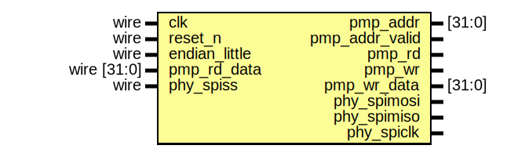
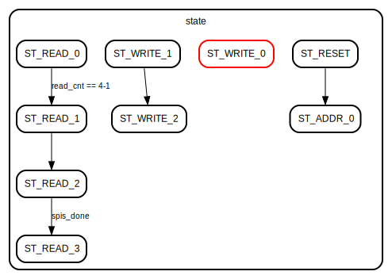
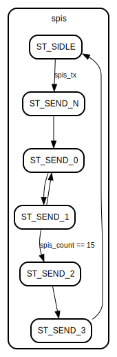
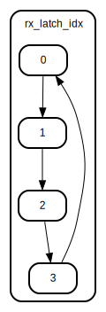

# Entity: io_bridge_peripheral 

- **File**: io_bridge_peripheral.v
## Diagram

## Ports

| Port name      | Direction | Type           | Description |
| -------------- | --------- | -------------- | ----------- |
| clk            | input     | wire           |             |
| reset_n        | input     | wire           |             |
| endian_little  | input     | wire           |             |
| pmp_addr       | output    | [31:0]         |             |
| pmp_addr_valid | output    |                |             |
| pmp_rd         | output    |                |             |
| pmp_rd_data    | input     | wire    [31:0] |             |
| pmp_wr         | output    |                |             |
| pmp_wr_data    | output    | [31:0]         |             |
| phy_spimosi    | inout     |                |             |
| phy_spimiso    | inout     |                |             |
| phy_spiclk     | inout     |                |             |
| phy_spiss      | input     | wire           |             |
## Signals

| Name              | Type       | Description |
| ----------------- | ---------- | ----------- |
| reset_n_s         | wire       |             |
| endian_little_s   | wire       |             |
| phy_spiss_s       | wire       |             |
| phy_spiss_r       | wire       |             |
| phy_spiss_f       | wire       |             |
| state             | reg [4:0]  |             |
| addr_cnt          | reg [1:0]  |             |
| data_cnt          | reg [1:0]  |             |
| read_cnt          | reg [6:0]  |             |
| rx_byte_done_s    | wire       |             |
| rx_byte_done_r    | wire       |             |
| bursting          | reg        |             |
| spis              | reg [4:0]  |             |
| spis_tx           | reg        |             |
| spis_word_tx      | reg [31:0] |             |
| spis_word         | reg [31:0] |             |
| spis_count        | reg [4:0]  |             |
| spis_done         | reg        |             |
| rx_byte_done_r_1  | reg        |             |
| rx_byte_done_r_2  | reg        |             |
| rx_byte_1         | reg [7:0]  |             |
| rx_byte_2         | reg [7:0]  |             |
| pmp_wr_data_latch | reg [31:0] |             |
| pmp_rd_data_e     | reg [31:0] |             |
| pmp_rd_data_buf   | reg [31:0] |             |
| rx_latch_idx      | reg [1:0]  |             |
| rx_dat            | reg [7:0]  |             |
| rx_byte           | reg [7:0]  |             |
| rx_byte_done      | reg        |             |
## Constants

| Name       | Type | Value | Description |
| ---------- | ---- | ----- | ----------- |
| ST_RESET   |      | 'd0   |             |
| ST_IDLE    |      | 'd1   |             |
| ST_READ_0  |      | 'd2   |             |
| ST_READ_1  |      | 'd3   |             |
| ST_READ_2  |      | 'd4   |             |
| ST_READ_3  |      | 'd5   |             |
| ST_WRITE_0 |      | 'd6   |             |
| ST_WRITE_1 |      | 'd7   |             |
| ST_WRITE_2 |      | 'd8   |             |
| ST_WRITE_3 |      | 'd9   |             |
| ST_ADDR_0  |      | 'd9   |             |
| ST_SIDLE   |      | 'd1   |             |
| ST_SEND_N  |      | 'd6   |             |
| ST_SEND_0  |      | 'd2   |             |
| ST_SEND_1  |      | 'd3   |             |
| ST_SEND_2  |      | 'd4   |             |
| ST_SEND_3  |      | 'd5   |             |
## Processes
- unnamed: ( @(*) )
  - **Type:** always
- unnamed: ( @(posedge clk) )
  - **Type:** always
- unnamed: ( @(posedge phy_spiclk or posedge phy_spiss) )
  - **Type:** always
## Instantiations

- s00: synch_3
- s81: synch_3
- s02: synch_3
- s03: synch_3
## State machines

