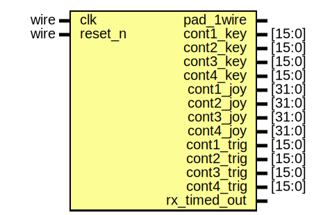
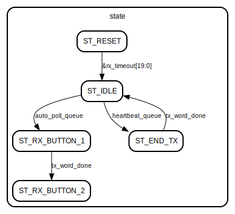
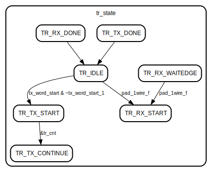

# Entity: io_pad_controller 

- **File**: io_pad_controller.v
## Diagram

## Ports

| Port name    | Direction | Type   | Description |
| ------------ | --------- | ------ | ----------- |
| clk          | input     | wire   |             |
| reset_n      | input     | wire   |             |
| pad_1wire    | inout     |        |             |
| cont1_key    | output    | [15:0] |             |
| cont2_key    | output    | [15:0] |             |
| cont3_key    | output    | [15:0] |             |
| cont4_key    | output    | [15:0] |             |
| cont1_joy    | output    | [31:0] |             |
| cont2_joy    | output    | [31:0] |             |
| cont3_joy    | output    | [31:0] |             |
| cont4_joy    | output    | [31:0] |             |
| cont1_trig   | output    | [15:0] |             |
| cont2_trig   | output    | [15:0] |             |
| cont3_trig   | output    | [15:0] |             |
| cont4_trig   | output    | [15:0] |             |
| rx_timed_out | output    |        |             |
## Signals

| Name            | Type       | Description |
| --------------- | ---------- | ----------- |
| reset_n_s       | wire       |             |
| pad_1wire_s     | wire       |             |
| pad_1wire_r     | wire       |             |
| pad_1wire_f     | wire       |             |
| rx_timeout      | reg [20:0] |             |
| auto_poll_cnt   | reg [15:0] |             |
| auto_poll_queue | reg        |             |
| heartbeat_cnt   | reg [18:0] |             |
| heartbeat_queue | reg        |             |
| state           | reg [3:0]  |             |
| cnt             | reg [3:0]  |             |
| reset_tr_n      | reg        |             |
| rx_word_done    | reg        |             |
| rx_word_shift   | reg [31:0] |             |
| rx_word         | reg [31:0] |             |
| tx_word_start   | reg        |             |
| tx_word_start_1 | reg        |             |
| tx_word_done    | reg        |             |
| tx_word         | reg [31:0] |             |
| tx_word_shift   | reg [31:0] |             |
| tr_cnt          | reg [7:0]  |             |
| tr_bit          | reg [5:0]  |             |
| tr_state        | reg [3:0]  |             |
## Constants

| Name           | Type | Value | Description |
| -------------- | ---- | ----- | ----------- |
| ST_RESET       |      | 'd0   |             |
| ST_IDLE        |      | 'd1   |             |
| ST_RX_BUTTON_1 |      | 'd2   |             |
| ST_RX_BUTTON_2 |      | 'd3   |             |
| ST_TX_SCALER   |      | 'd4   |             |
| ST_END_TX      |      | 'd5   |             |
| BITLEN         |      | 60    |             |
| TR_IDLE        |      | 'd1   |             |
| TR_TX_START    |      | 'd2   |             |
| TR_TX_CONTINUE |      | 'd3   |             |
| TR_TX_DONE     |      | 'd4   |             |
| TR_RX_START    |      | 'd5   |             |
| TR_RX_WAITEDGE |      | 'd6   |             |
| TR_RX_DONE     |      | 'd7   |             |
## Processes
- unnamed: ( @(posedge clk) )
  - **Type:** always
- unnamed: ( @(posedge clk) )
  - **Type:** always
## Instantiations

- s00: synch_3
- s01: synch_3
## State machines

