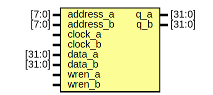

# Entity: mf_datatable 

- **File**: mf_datatable.v
## Diagram

## Ports

| Port name | Direction | Type   | Description |
| --------- | --------- | ------ | ----------- |
| address_a | input     | [7:0]  |             |
| address_b | input     | [7:0]  |             |
| clock_a   | input     |        |             |
| clock_b   | input     |        |             |
| data_a    | input     | [31:0] |             |
| data_b    | input     | [31:0] |             |
| wren_a    | input     |        |             |
| wren_b    | input     |        |             |
| q_a       | output    | [31:0] |             |
| q_b       | output    | [31:0] |             |
## Signals

| Name      | Type        | Description |
| --------- | ----------- | ----------- |
| clock_a   | tri1        |             |
| wren_a    | tri0        |             |
| wren_b    | tri0        |             |
| sub_wire0 | wire [31:0] |             |
| sub_wire1 | wire [31:0] |             |
| q_a       | wire [31:0] |             |
| q_b       | wire [31:0] |             |
## Instantiations

- altsyncram_component: altsyncram
