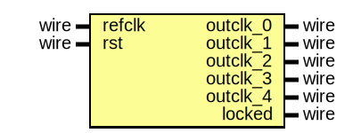

# Entity: mf_pllbase 

- **File**: mf_pllbase.v
## Diagram

## Ports

| Port name | Direction | Type | Description |
| --------- | --------- | ---- | ----------- |
| refclk    | input     | wire |             |
| rst       | input     | wire |             |
| outclk_0  | output    | wire |             |
| outclk_1  | output    | wire |             |
| outclk_2  | output    | wire |             |
| outclk_3  | output    | wire |             |
| outclk_4  | output    | wire |             |
| locked    | output    | wire |             |
## Instantiations

- mf_pllbase_inst: mf_pllbase_0002
